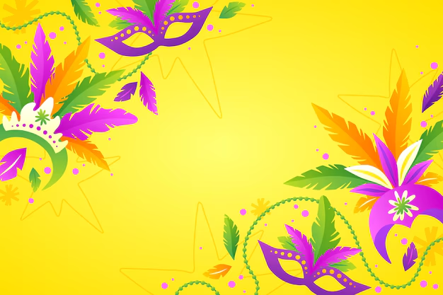

# 🎭 Jogo de Carnaval em Java Swing 🎉



## 📋 Sobre o Projeto

Este é um jogo festivo desenvolvido em Java com a biblioteca Swing para celebrar o carnaval! O jogador controla um folião que coleta confetes coloridos enquanto serpentinas dançam pelo ar, tudo ao som de uma tradicional marchinha de carnaval.

## ✨ Características

- 🕹️ Controle um folião animado com chapéu de carnaval
- 🎊 Colete confetes para ganhar pontos
- 🎭 Desvie e pule enquanto serpentinas coloridas caem do céu
- 🎵 Música de marchinha de carnaval tocando ao fundo
- 🌈 Interface gráfica colorida e festiva

## 🎮 Como Jogar

### Controles
- ⬅️ **Seta Esquerda**: Move o folião para a esquerda
- ➡️ **Seta Direita**: Move o folião para a direita
- **Barra de Espaço**: Faz o folião pular
- **Qualquer tecla**: Inicia o jogo na tela inicial

### Objetivo
Colete o máximo de confetes possível para aumentar sua pontuação! Cada confete vale 10 pontos.

## 🛠️ Requisitos Técnicos

- Java JDK 8 ou superior
- Sem dependências externas (usa apenas bibliotecas padrão do Java)

## ⚙️ Instalação e Execução

1. Clone este repositório:
   ```bash
   git clone https://github.com/seu-usuario/jogo-carnaval.git
   ```

2. Navegue até a pasta do projeto:
   ```bash
   cd jogo-carnaval
   ```

3. Compile o código:
   ```bash
   javac JogoCarnaval.java
   ```

4. Execute o jogo:
   ```bash
   java JogoCarnaval
   ```

## 📁 Estrutura de Arquivos

```
jogo-carnaval/
│
├── JogoCarnaval.java       # Código fonte do jogo
├── marchinha.wav           # Arquivo de áudio para música de fundo
├── fundo_carnaval.png      # Imagem para a tela inicial
└── README.md               # Este arquivo
```

## 📝 Modificações Recentes

- Os arquivos de mídia (`marchinha.wav` e `fundo_carnaval.png`) agora estão localizados na raiz do projeto para facilitar a execução.
- Ajustes no código para carregar os arquivos da nova localização.

## 🎯 Ideias para Melhorias Futuras

- 🏆 Sistema de ranking e recordes
- 🎁 Itens especiais com efeitos diferentes
- 👾 Obstáculos que devem ser evitados
- 📊 Diferentes níveis de dificuldade
- 🎨 Personagens adicionais com fantasias variadas

## 📷 Capturas de Tela


*A tela inicial do jogo*

## 👨‍💻 Desenvolvimento

Este jogo foi desenvolvido usando conceitos de:

- Programação Orientada a Objetos
- Interface gráfica com Java Swing
- Animações e detecção de colisão
- Reprodução de áudio com a API javax.sound

## 📜 Licença

Este projeto está licenciado sob a licença MIT - veja o arquivo LICENSE para detalhes.

---

🎉 **Feliz Carnaval!** 🎊
